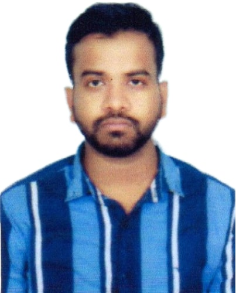

# Laxmidhar Barik

  
  
LB

## VLSI Physical Design Engineer

**Ph.D. Scholar, VLSI Design & Embedded Systems**  
NIT Raipur, Chhattisgarh · M.Tech CGPA: 9.12 / 10

---

[:fontawesome-solid-layer-group: View Projects](projects/index.md){ .md-button .md-button--primary }
[:fontawesome-solid-file-pdf: Download Resume](resume/index.md){ .md-button }
[:fontawesome-solid-envelope: Contact Me](contact/index.md){ .md-button }

---

## About Me

I am a VLSI Design Engineer with a strong background in **RTL Design, Analog IC Design, Hardware Verification**, and **Physical Design**. I completed my M.Tech in VLSI Design & Embedded Systems from NIT Raipur with a CGPA of **9.12/10**, and my B.Tech in Electrical & Electronics from BPUT, Odisha with a CGPA of **9.04/10**.

I have hands-on experience with industry-standard EDA tools including **Cadence Virtuoso**, **Xilinx Vivado**, **LTspice**, **Magic VLSI**, and open-source flows like **OpenLane/OpenROAD**. My research spans device-level biosensor simulation and digital/analog IC design.

I have qualified **GATE 2023 (AIR 3193)** and **GATE 2024 (AIR 6005)** in Electrical Engineering, reflecting strong fundamentals across the domain.

---

## Core Expertise

### :fontawesome-solid-microchip: RTL & Digital Design
Verilog, VHDL, SystemVerilog, FSM design, FIFO/LIFO, Xilinx ISE/Vivado

### :fontawesome-solid-wave-square: Analog IC Design
PLL, OTA (Miller), Cadence Virtuoso, LTspice, AC/DC analysis, Phase Margin

### :fontawesome-solid-check-double: Hardware Verification
SystemVerilog testbenches, UVM architecture, layered verification, scoreboard

### :fontawesome-solid-flask: Device Research
AlN/β-Ga₂O₃ MOSHEMT biosensor, TCAD simulation, Silvaco, pH sensor analysis

---

## Education

| Degree | Institution | Year | CGPA/% |
|--------|-------------|------|--------|
| **M.Tech, VLSI Design & Embedded Systems** | NIT Raipur, Chhattisgarh | 2023–2025 | 9.12 |
| B.Tech, Electrical & Electronics Engineering | BPUT, Odisha | 2018–2022 | 9.04 |
| Intermediate (12th) | CHSE, Odisha | 2015–2017 | 83.89% |
| 10th | BSEO, Odisha | 2015 | 88.83% |

---

## Achievements

!!! success "Key Highlights"
    - **GATE 2023 (EE):** Qualified with AIR **3193**
    - **GATE 2024 (EE):** Qualified with AIR **6005**
    - M.Tech CGPA: **9.12 / 10** at NIT Raipur
    - Teaching Assistant for HDV (Verilog) and C++ Programming at NIT Raipur
    - 4 research publications including IEEE DevIC 2025 and IEEE BIO-SENSORS 2025

!!! info "Currently Seeking"
    Full-time roles in **VLSI Physical Design**, **RTL Design**, **Analog IC Design**, and **Hardware Verification** at semiconductor companies.
